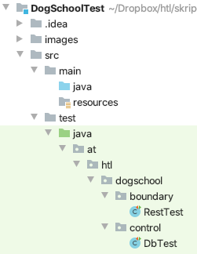

= dogschool-jakartaee-test
:source-highlighter: coderay
:icons: font

++++
<link rel="stylesheet"  href="http://cdnjs.cloudflare.com/ajax/libs/font-awesome/4.7.0/css/font-awesome.min.css">
++++

== System Tests

* DbTest checks the state after executing the InitBean
* RestTests check the http-methods for the CourseTypeEndpoint (and Bookingendpoint)

== Changing the Names of the Tables

[source,java]
.DbTest.java
----
include::src/test/java/at/htl/dogschool/control/DbTest.java[tag=table-names]
----

Use the comments to between tableNames for DBTest and RestTest

== Configuring IntelliJ for Running All Tests

So you can start all tests with one click.

image::./images/run-all-tests-configuration.png[]